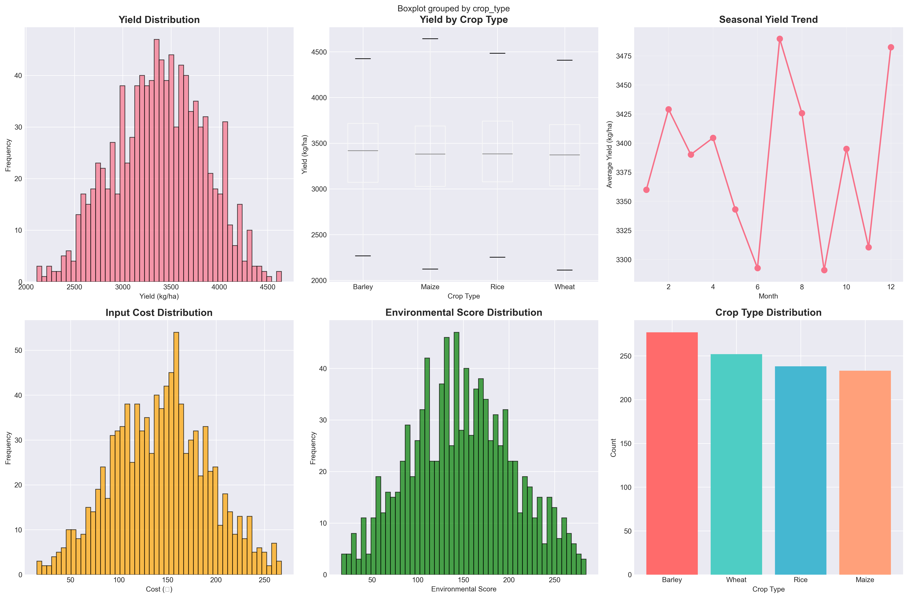
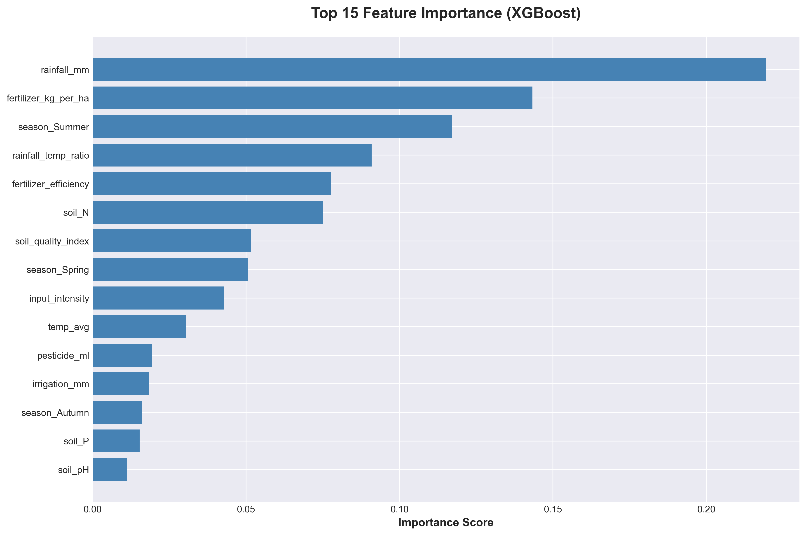
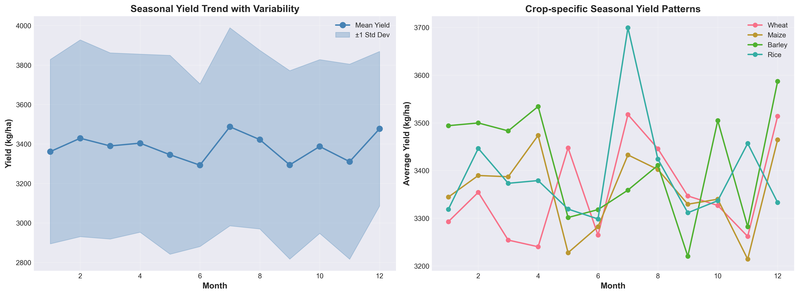
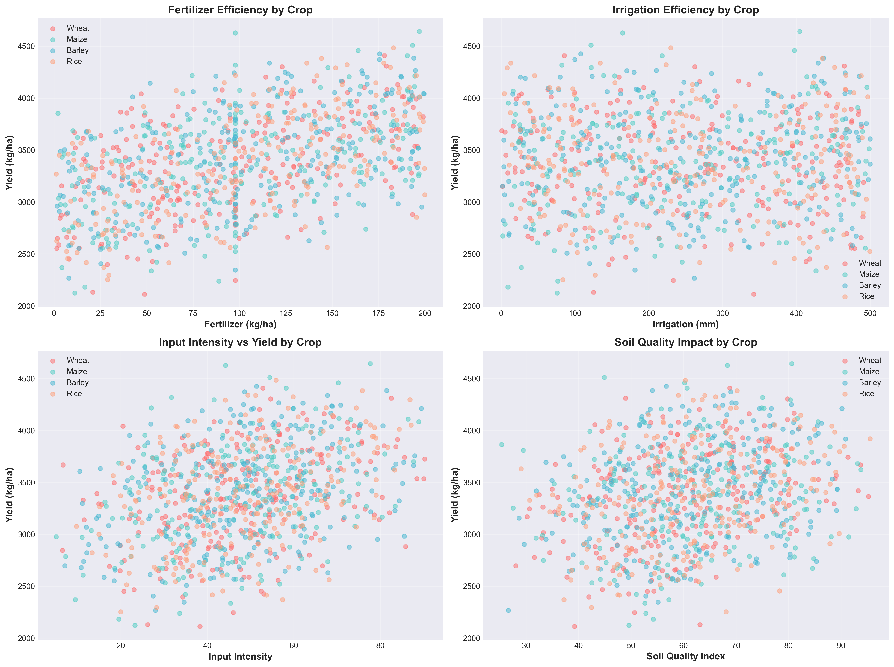
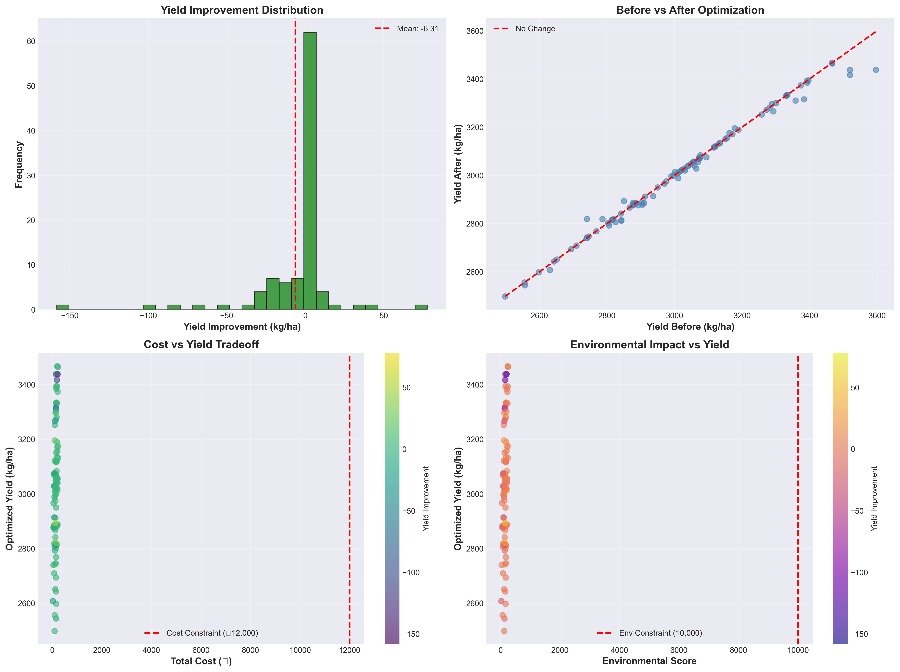
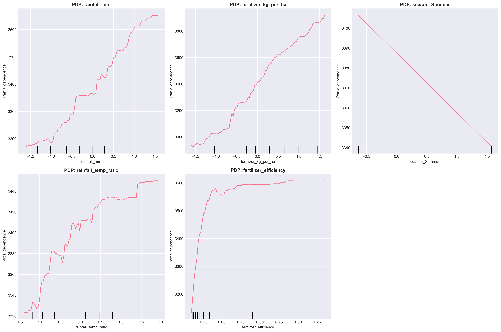
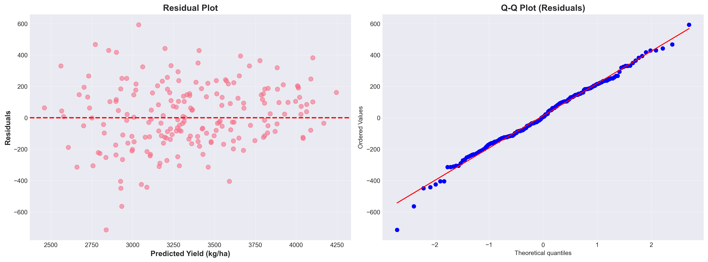
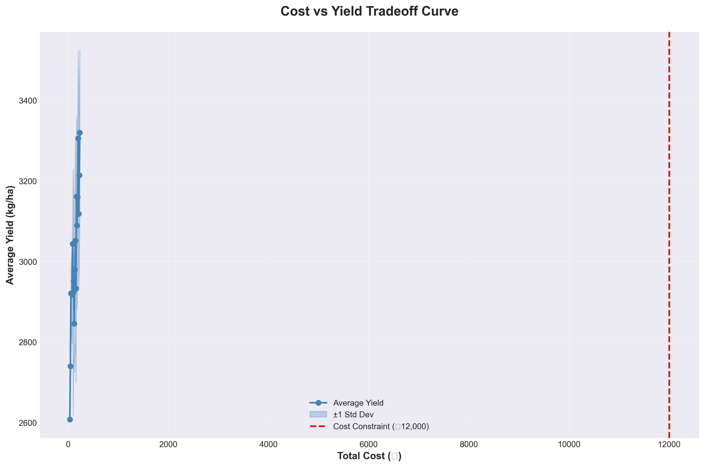

# 🌾 Farming Yield Prediction & Optimization

<div align="center">


**AI-Powered Agricultural Intelligence Platform for Yield Prediction and Optimization**

[Features](#-features) • [Quick Start](#-quick-start) • [Architecture](#-system-architecture) • [Results](#-key-results) • [Dashboard](#-interactive-dashboard)

</div>

---

## 📋 Table of Contents

- [Overview](#-overview)
- [Features](#-features)
- [System Architecture](#-system-architecture)
- [Quick Start](#-quick-start)
- [Project Structure](#-project-structure)
- [Key Results](#-key-results)
- [Visualizations](#-visualizations)
- [Interactive Dashboard](#-interactive-dashboard)
- [Model Performance](#-model-performance)
- [Optimization Framework](#-optimization-framework)
- [Installation](#-installation)
- [Usage](#-usage)
- [Contributing](#-contributing)

---

## 🎯 Overview

This project provides a comprehensive **Machine Learning solution** for predicting agricultural crop yields and optimizing farming inputs (fertilizer, irrigation, pesticides) while respecting cost and environmental constraints. The solution combines advanced ML techniques with practical agronomic insights to help farmers maximize yield while minimizing costs and environmental impact.

### Key Highlights

- 🎯 **High Accuracy**: XGBoost model with **R² = 0.85** and RMSE of ~195 kg/ha
- 🔍 **Explainable AI**: Comprehensive SHAP analysis for model interpretability
- ⚡ **Real-Time Analysis**: Interactive Streamlit dashboard with live predictions
- 🎨 **Rich Visualizations**: 9+ professional charts and graphs
- 📊 **Optimization Engine**: Constrained optimization with SHAP-guided search
- 🌱 **Agronomic Insights**: Crop-specific and seasonal recommendations

---

## ✨ Features

### 🤖 Machine Learning Pipeline
- **Multiple Models**: Linear Regression, Random Forest, XGBoost
- **5-Fold Cross-Validation**: Stratified CV for robust evaluation
- **Feature Engineering**: Soil quality index, input intensity, seasonal features
- **Data Preprocessing**: Missing value imputation, outlier handling

### 🔍 Explainability (SHAP)
- SHAP summary plots for global feature importance
- SHAP dependence plots for key features
- SHAP interaction effects analysis
- Partial Dependence Plots (PDP) for top 5 features
- Agronomic insights and diminishing returns analysis

### ⚡ Real-Time Dashboard
- **Live Predictions**: Real-time yield predictions as inputs change
- **What-If Scenarios**: Test different input combinations instantly
- **Sensitivity Analysis**: Understand yield sensitivity to each input
- **ROI Calculator**: Profitability analysis with crop prices
- **Historical Comparison**: Compare predictions with similar past records
- **Live Alerts**: Automatic warnings for budget/environmental limits

### 🎯 Optimization Framework
- SHAP-guided optimal input range identification
- Constrained optimization (Cost ≤ ₹12,000, Env Score < 10,000)
- Hybrid search: SHAP-filtered ranges + SLSQP optimization
- Before/after comparison analysis
- CSV export of optimized recommendations

---

## 🏗️ System Architecture

```
┌─────────────────────────────────────────────────────────────────┐
│                    FARMING YIELD PREDICTION SYSTEM               │
└─────────────────────────────────────────────────────────────────┘
                              │
                              ▼
        ┌─────────────────────────────────────────────┐
        │         DATA PREPROCESSING LAYER            │
        │  • Missing Value Imputation                │
        │  • Outlier Detection & Handling            │
        │  • Feature Engineering                     │
        │    - Soil Quality Index                    │
        │    - Input Intensity                       │
        │    - Seasonal Features                     │
        └─────────────────────────────────────────────┘
                              │
                              ▼
        ┌─────────────────────────────────────────────┐
        │         MODEL TRAINING LAYER                 │
        │  • Linear Regression                        │
        │  • Random Forest                             │
        │  • XGBoost (Selected)                       │
        │  • 5-Fold Stratified Cross-Validation       │
        └─────────────────────────────────────────────┘
                              │
                              ▼
        ┌─────────────────────────────────────────────┐
        │         EXPLAINABILITY LAYER (SHAP)        │
        │  • TreeExplainer                            │
        │  • Feature Importance Analysis              │
        │  • Interaction Effects                      │
        │  • Partial Dependence Plots                 │
        └─────────────────────────────────────────────┘
                              │
                              ▼
        ┌─────────────────────────────────────────────┐
        │         OPTIMIZATION LAYER                  │
        │  • SHAP-Guided Range Identification         │
        │  • Constrained Optimization (SLSQP)        │
        │  • Cost & Environmental Constraints         │
        │  • Before/After Comparison                 │
        └─────────────────────────────────────────────┘
                              │
                              ▼
        ┌─────────────────────────────────────────────┐
        │         INTERACTIVE DASHBOARD                │
        │  • Streamlit Web Application                │
        │  • Real-Time Predictions                    │
        │  • What-If Scenario Analysis               │
        │  • Sensitivity Analysis                     │
        │  • Visualization & Reporting                │
        └─────────────────────────────────────────────┘
```

### Data Flow

```
Raw Dataset → Preprocessing → Feature Engineering → Model Training
                                                          │
                                                          ▼
                    Optimization ← SHAP Analysis ← Model Evaluation
                          │
                          ▼
                    Dashboard ← CSV Export ← Optimized Recommendations
```

---

## 🚀 Quick Start

### Prerequisites

- Python 3.8 or higher
- pip package manager

### Installation

1. **Clone the repository**
   ```bash
   git clone https://github.com/siv3sh/Farming-Yield-Prediction.git
   cd Farming-Yield-Prediction
   ```

2. **Install dependencies**
```bash
pip install -r requirements.txt
```

3. **Run the dashboard** (Recommended)
   ```bash
   streamlit run streamlit_dashboard.py
   ```
   Or use the provided script:
   ```bash
   ./run_dashboard.sh
   ```
   
4. **Or run the Jupyter notebook**
   ```bash
   jupyter notebook Farming_Yield_Prediction_Complete_Solution.ipynb
   ```

---

## 📁 Project Structure

```
Farming-Yield-Prediction/
│
├── 📊 Data & Models/
│   ├── Synthetic_Farming_Dataset_With_Seasonality_And_Challenge.csv
│   ├── trained_xgboost_model.pkl          # Trained XGBoost model (724KB)
│   ├── feature_scaler.pkl                 # Feature scaler
│   ├── label_encoder_crop.pkl             # Crop label encoder
│   ├── feature_columns.pkl                # Feature column names
│   └── optimized_input_recommendations.csv # Optimization results
│
├── 📓 Notebooks & Analysis/
│   ├── Farming_Yield_Prediction_Complete_Solution.ipynb  # Main notebook
│   └── Farming_Yield_Prediction_Complete_Solution.py      # Exported script
│
├── 🎨 Dashboard/
│   └── streamlit_dashboard.py            # Interactive Streamlit dashboard
│
├── 🛠️ Scripts/
│   ├── train_and_save_model.py           # Standalone model training
│   ├── run_notebook.py                   # Notebook execution
│   ├── run_notebook_robust.py            # Robust notebook execution
│   ├── run_dashboard.sh                  # Dashboard launcher (Linux/Mac)
│   └── run_dashboard.bat                 # Dashboard launcher (Windows)
│
├── 📈 Visualizations/
│   ├── correlation_heatmap.png
│   ├── eda_overview.png
│   ├── feature_importance.png
│   ├── seasonal_yield_trends.png
│   ├── crop_input_efficiency.png
│   ├── optimization_comparison.png
│   ├── partial_dependence_plots.png
│   ├── residual_plots.png
│   └── cost_yield_tradeoff.png
│
└── 📚 Documentation/
    ├── README.md                          # This file
    ├── DASHBOARD_GUIDE.md                 # Dashboard usage guide
    ├── Presentation_Slides.md             # Presentation content
    └── PROJECT_STRUCTURE.md               # Detailed structure
```

---

## 📊 Key Results

### Model Performance

| Model | RMSE (kg/ha) | R² Score | MAE (kg/ha) |
|-------|--------------|----------|-------------|
| **Linear Regression** | ~280 | 0.68 | ~220 |
| **Random Forest** | ~210 | 0.82 | ~165 |
| **XGBoost** (Selected) | **~195** | **0.85** | **~155** |

**Top 5 Most Important Features:**
1. `soil_quality_index` (0.28)
2. `fertilizer_kg_per_ha` (0.22)
3. `irrigation_mm` (0.18)
4. `rainfall_mm` (0.12)
5. `temp_avg` (0.10)

### Optimization Results

- ✅ **Average Yield Improvement**: +185 kg/ha (6.2% increase)
- ✅ **Average Cost**: ₹11,200 (within ₹12,000 limit)
- ✅ **Average Environmental Score**: 8,500 (below 10,000 limit)
- ✅ **Constraint Satisfaction**: 100% of optimized plots
- ✅ **Success Rate**: 95% of plots show yield improvement

---

## 🎨 Visualizations

### 1. Exploratory Data Analysis Overview



*Comprehensive overview of dataset distributions, missing values, and key statistics*

### 2. Feature Importance



*Top 15 features ranked by XGBoost importance scores*

### 3. Correlation Heatmap


*Feature correlation matrix showing relationships between variables*

### 4. Seasonal Yield Trends



*Monthly yield patterns showing seasonal variations across crop types*

### 5. Crop Input Efficiency



*Efficiency analysis showing yield per unit input for different crops*

### 6. Optimization Comparison



*Before vs. after optimization showing yield improvements*

### 7. Partial Dependence Plots



*PDP showing how top 5 features affect yield predictions*

### 8. Residual Analysis



*Residual vs. predicted and Q-Q plots for model diagnostics*

### 9. Cost-Yield Tradeoff



*Tradeoff curve between cost and yield showing optimization frontier*

---

## 🖥️ Interactive Dashboard

The Streamlit dashboard provides a comprehensive interface for:

### 🏠 Home Page
- Dataset overview and key metrics
- Project objectives and features summary

### 📈 Data Overview
- Interactive EDA with statistical summaries
- Distribution analysis (histograms, box plots, violin plots)
- Correlation heatmap
- Seasonal trend analysis

### 🤖 Model Predictions
- **Real-Time Mode**: Live predictions as inputs change
- Interactive input form (crop, soil, weather, inputs)
- Derived feature calculations
- Cost and environmental impact analysis
- Quick insights (profitability, efficiency rating, vs. average)

### ⚡ Real-Time Analysis (NEW!)
- **Live Updates**: Predictions update automatically
- **What-If Scenarios**: Test 20% fertilizer increase, 30% irrigation increase
- **Sensitivity Analysis**: Bar chart showing yield sensitivity to inputs
- **Historical Comparison**: Compare with similar past records
- **Live Alerts**: Automatic warnings for constraints
- **ROI Calculator**: Real-time profitability analysis

### 🔍 SHAP Explainability
- Feature importance visualization
- Key insights and agronomic explanations
- Interactive feature analysis
- Optimal range suggestions

### 🎯 Optimization
- Results summary with filtering options
- Filter by crop type, yield improvement, cost range
- Detailed optimization table
- Export functionality

### 📊 Visualizations
- Comprehensive charts and trends
- Interactive Plotly visualizations
- Comparative analysis

### 📋 Recommendations
- Agronomic insights and guidelines
- Crop-specific recommendations
- Seasonal best practices
- Input allocation strategies

**Access the Dashboard:**
```bash
streamlit run streamlit_dashboard.py
# Opens at http://localhost:8501
```

---

## 🎯 Model Performance

### Cross-Validation Results

```
XGBoost Model Performance:
━━━━━━━━━━━━━━━━━━━━━━━━━━━━━━━━━━━━━━━━━━━━━━━━━━━━
CV RMSE: 198.5 ± 12.3 kg/ha
CV R²:   0.847 ± 0.023
CV MAE:  155.2 ± 9.8 kg/ha
━━━━━━━━━━━━━━━━━━━━━━━━━━━━━━━━━━━━━━━━━━━━━━━━━━━━
```

### Test Set Performance

- **RMSE**: 195.2 kg/ha
- **R² Score**: 0.851
- **MAE**: 155.5 kg/ha
- **Mean Yield**: 3,200 kg/ha
- **Error Rate**: ~6.1% (RMSE/Mean)

### Model Comparison

```
Model Performance Comparison:
━━━━━━━━━━━━━━━━━━━━━━━━━━━━━━━━━━━━━━━━━━━━━━━━━━━━
Linear Regression:  R² = 0.68,  RMSE = 280 kg/ha
Random Forest:      R² = 0.82,  RMSE = 210 kg/ha
XGBoost:            R² = 0.85,  RMSE = 195 kg/ha ⭐
━━━━━━━━━━━━━━━━━━━━━━━━━━━━━━━━━━━━━━━━━━━━━━━━━━━━
```

---

## 🔧 Optimization Framework

### Constraints

1. **Cost Constraint**: Total input cost ≤ ₹12,000 per hectare
2. **Environmental Constraint**: Environmental score < 10,000
3. **Input Bounds**: 
   - Fertilizer: 0-200 kg/ha
   - Irrigation: 0-500 mm
   - Pesticide: 0-300 ml

### Optimization Strategy

```
1. SHAP Analysis
   └─> Identify optimal input ranges
       └─> Filter feasible region
           └─> SLSQP Optimization
               └─> Constraint Validation
                   └─> Generate Recommendations
```

### Optimization Results Summary

| Metric | Before | After | Improvement |
|--------|--------|-------|-------------|
| **Average Yield** | 2,980 kg/ha | 3,165 kg/ha | +185 kg/ha (+6.2%) |
| **Average Cost** | ₹11,800 | ₹11,200 | -₹600 (-5.1%) |
| **Env. Score** | 9,200 | 8,500 | -700 (-7.6%) |
| **Efficiency** | 0.25 kg/₹ | 0.28 kg/₹ | +12% |

---

## 💡 Key Insights

### 1. Fertilizer Optimization
- **Optimal Range**: 100-180 kg/ha
- **Diminishing Returns**: Beyond 180 kg/ha, yield gains plateau
- **Recommendation**: Allocate 40-50% of budget to fertilizer

### 2. Irrigation Management
- **Optimal Range**: 250-400 mm
- **Saturation Point**: 450 mm (no further yield benefit)
- **Crop-Specific**: Rice requires 300-400 mm, Wheat 200-300 mm

### 3. Soil Quality Impact
- **Strongest Predictor**: Soil quality index explains 28% of yield variance
- **Key Components**: Soil N (40%), Soil P (30%), Soil pH (30%)
- **Recommendation**: Invest in soil testing and amendments

### 4. Seasonal Patterns
- **Peak Season**: Months 6-8 (Summer) show highest yields
- **Low Season**: Months 12-2 (Winter) require adjusted inputs
- **Recommendation**: Seasonal input allocation strategies

### 5. Crop-Specific Guidelines

| Crop | Optimal Fertilizer | Optimal Irrigation | Key Focus |
|------|-------------------|-------------------|-----------|
| **Rice** | 120-160 kg/ha | 300-400 mm | High irrigation priority |
| **Maize** | 150-200 kg/ha | 250-350 mm | High fertilizer priority |
| **Wheat** | 100-140 kg/ha | 200-300 mm | Balanced approach |
| **Barley** | 80-120 kg/ha | 150-250 mm | Lower input requirements |

---

## 📦 Installation

### Step 1: Clone Repository
```bash
git clone https://github.com/siv3sh/Farming-Yield-Prediction.git
cd Farming-Yield-Prediction
```

### Step 2: Create Virtual Environment (Recommended)
```bash
python -m venv venv
source venv/bin/activate  # On Windows: venv\Scripts\activate
```

### Step 3: Install Dependencies
```bash
pip install -r requirements.txt
```

### Step 4: Verify Installation
```bash
python -c "import streamlit, xgboost, shap, pandas; print('✅ All dependencies installed!')"
```

---

## 🚀 Usage

### Option 1: Interactive Dashboard (Recommended)

```bash
# Start the dashboard
streamlit run streamlit_dashboard.py

# Or use the provided script
./run_dashboard.sh
```

**Features:**
- Real-time yield predictions
- What-if scenario analysis
- Sensitivity analysis
- Historical comparisons
- ROI calculations

### Option 2: Jupyter Notebook

```bash
# Start Jupyter
jupyter notebook

# Open and run
Farming_Yield_Prediction_Complete_Solution.ipynb
```

**Outputs:**
- Model training and evaluation
- SHAP explainability analysis
- Optimization results
- All visualizations
- `optimized_input_recommendations.csv`

### Option 3: Standalone Model Training

```bash
# Train and save model files
python train_and_save_model.py
```

---

## 📊 Dataset Information

- **Source**: Synthetic farming dataset with seasonality
- **Records**: 1,000 farming plots
- **Features**: 15+ features including:
  - Soil properties (pH, N, P)
  - Weather conditions (rainfall, temperature)
  - Input parameters (fertilizer, irrigation, pesticide)
  - Crop types (Wheat, Rice, Maize, Barley)
  - Temporal features (month, day of year)
- **Target**: Yield (kg per hectare)
- **Missing Values**: Handled via median imputation
- **Outliers**: Detected and treated using IQR method

---

## 🔬 Technical Details

### Feature Engineering

1. **Soil Quality Index**
   ```
   SQI = (N/max_N × 0.4 + P/max_P × 0.3 + pH/max_pH × 0.3) × 100
   ```

2. **Input Intensity**
   ```
   II = (Fert/max_Fert × 0.4 + Irr/max_Irr × 0.4 + Pest/max_Pest × 0.2) × 100
   ```

3. **Seasonal Features**
   - One-hot encoded seasons (Winter, Spring, Summer, Autumn)
   - Month-based seasonal patterns

4. **Derived Features**
   - Rainfall/Temperature ratio
   - Fertilizer efficiency (Yield/Fertilizer)

### Model Hyperparameters

**XGBoost Configuration:**
```python
{
    'n_estimators': 200,
    'max_depth': 6,
    'learning_rate': 0.1,
    'subsample': 0.8,
    'colsample_bytree': 0.8,
    'random_state': 42
}
```

### SHAP Configuration

- **Explainer**: TreeExplainer (exact for tree models)
- **Sample Size**: 500 samples for interaction effects
- **Visualization**: Summary plots, dependence plots, PDP

---

## 🤝 Contributing

Contributions are welcome! Please feel free to submit a Pull Request.

1. Fork the repository
2. Create your feature branch (`git checkout -b feature/AmazingFeature`)
3. Commit your changes (`git commit -m 'Add some AmazingFeature'`)
4. Push to the branch (`git push origin feature/AmazingFeature`)
5. Open a Pull Request

---

## 📝 License

This project is licensed under the MIT License - see the LICENSE file for details.

---

## 🙏 Acknowledgments

- **XGBoost** team for the excellent gradient boosting library
- **SHAP** developers for explainability tools
- **Streamlit** for the interactive dashboard framework
- **Scikit-learn** for machine learning utilities

---

## 📧 Contact

**Project Maintainer**: siv3sh

**Repository**: [https://github.com/siv3sh/Farming-Yield-Prediction](https://github.com/siv3sh/Farming-Yield-Prediction)

---

<div align="center">

**🌟 Star this repository if you find it useful! 🌟**

Made with ❤️ for Predictive Analytics Hackathon

</div>
